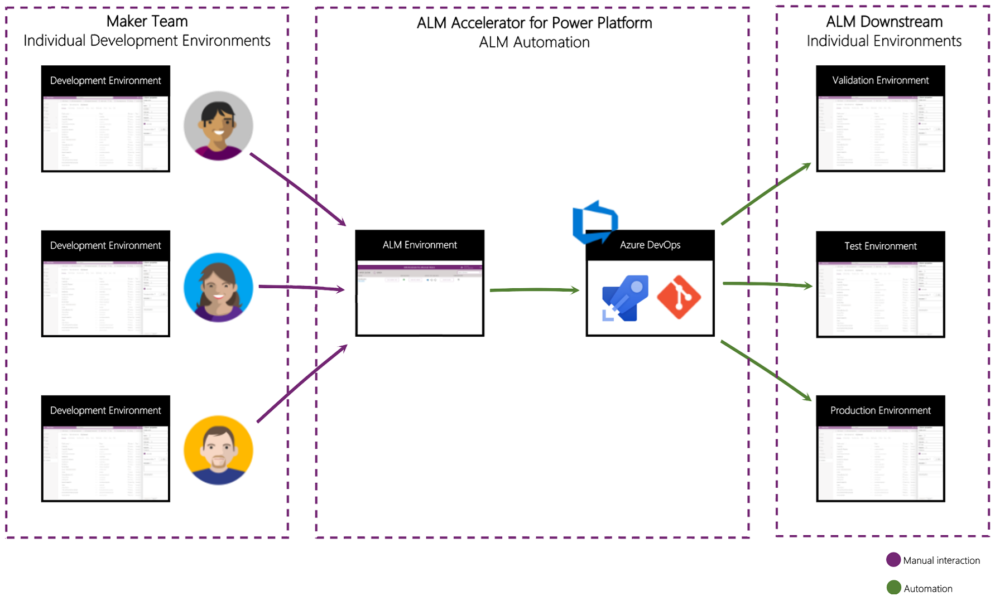

#PowerPlatformCoE 
Step by Step with screenshots on Power Platform CoE  ALM Accelerator. 
It comes with **Single Doucment**  

##Who should use the ALM Accelerator?

The ALM Accelerator is targeted at Power Platform **makers** and **maker teams:**

- Makers who are unfamiliar with ALM concepts, but want to be able to save their work, along with a history of changes, and share those changes with other users

- Makers who are comfortable with the advanced concepts of using Git, such as pull requests, branching, and merging, and want to work in a familiar way with source control and deployment automation

# Which this guide includes 

1.	**Overview ALM Accelerator for Power Platform** 

2.	**ALM Accelerator Licensing requirements** 

3.	**Azure App Registration** 

4. **Installing Azure DevOps Extensions**

5. **Troubleshooting and resolving Power Apps management permissions** 

6.	**Installation and Configure ALM Accelerator** 

7. **Configure Azure DevOps Custom connector**

8. **Setup your first Azure DevOps project with ALM Accelerator**

9. **Create an app user in your Dataverse environments**

10. **How Makers can use ALM projects within understanding Azure DevOps**

*** 

[20240107 How to use ALM Accelerator with Power Platform](<20231228 - ALM with Power Platform - ALM Accelerator.pdf>)